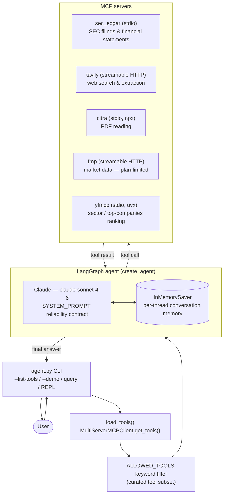

# Financial Analyst Agent

<!-- TODO: One-sentence pitch — what does this agent do and for whom? -->
An AI agent that answers financial research questions using SEC EDGAR filings and live web search, built with LangGraph.

## Example queries

<!-- TODO: Replace with real examples from your demo queries -->
- "What was Google's net income based on their latest quarterly report?"
- "What are the top 10 companies in healthcare?"
- "What are the top 10 companies in healthcare, and what was the reported income for each of those 10 companies?"
- "What was Apple's income and costs on their latest quarterly report?"

## Tools

- sec-edgar-mcp: This is my primary financial statement source. It directly accesses SEC EDGAR and exposes standardized income statements, balance sheets and cash-flow statements. This tool is mainly used for answering the questions regarding the net income, etc.
- Financial Modeling Prep (FMP): This tool is mainly used to answer questions regarding top-N companies by industry questions. FMP is convinient because its API already supports company screening, industry information and market capitalization.
- Tavily MCP: I used this for my searches and particularly answering questions regarding AI disruption. 
- citra pdf reader MCP: This is an MCP tool for reading PDF files so that if the user uploads a PDF the agent is able to read that pdf file

## Architecture

The CLI discovers tools from every configured MCP server, curates them down to
an allow-listed subset, and hands that subset to a single LangGraph agent.
The agent (Claude) calls tools as needed and keeps per-thread memory via a
checkpointer, so the CLI's interactive mode supports multi-turn follow-ups.

