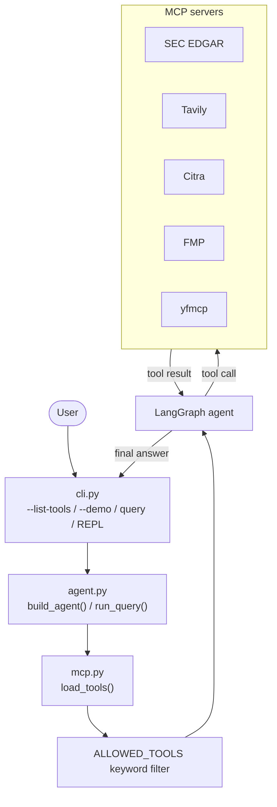

# Financial Analyst Agent

An MCP-powered CLI agent for researching public-company financial data from SEC
filings, market-data services, PDFs, and web research.

## Setup

1. Install dependencies with `uv sync`.
2. Copy `.env.example` to `.env` and populate the API keys you intend to use.
3. Run a query:

   ```bash
   uv run financial-analyst-agent "What was Apple's latest quarterly net income?"
   ```

Use `uv run financial-analyst-agent --help` to see the interactive, demo, and
tool-listing modes.

## Example queries

- "What was Google's net income based on their latest quarterly report?"
- "What are the top 10 companies in healthcare?"
- "What are the top 10 companies in healthcare, and what was the reported income for each?"
- "What was Apple's income and costs on their latest quarterly report?"

## Tools

- **SEC EDGAR MCP** — primary source for standardized SEC financial statements.
- **Financial Modeling Prep** — company screening, industry, and market-cap data.
- **Tavily MCP** — sourced web research, including industry and AI-adoption research.
- **Citra** — reads user-provided PDFs.
- **yfmcp** — sector and top-company rankings.

## Evaluation

`tests/financial_analyst.eval.py` runs both test sets (`financial_analyst_eval_dataset.json`
and `test_set.jsonl`) through the real agent and logs results to
[Braintrust](https://www.braintrust.dev). Each case is graded by an LLM judge
that respects that case's own grading rules — factual vs. behavioral,
`grading_note` tolerances (e.g. don't penalize stale market-cap snapshots),
and the `pass`/`fail_if` criteria in `test_set.jsonl`.

1. Set `BRAINTRUST_API_KEY` (and optionally `BRAINTRUST_PROJECT`) in `.env`.
2. Run:

   ```bash
   uv run braintrust eval tests/financial_analyst.eval.py
   ```

This calls the live MCP tools and Anthropic API for every case, so it costs
real API usage and can take a while for the full ~70-case set.

## Architecture

The CLI delegates command-line handling to `cli.py`. `agent.py` builds the
LangGraph agent and runs queries. `mcp.py` discovers MCP tools and selects the
allow-listed subset, while `config.py` holds server configuration and runtime
limits. The reliability contract lives in `prompts/financial_analyst.py`.



## Project layout

```text
src/financial_analyst_agent/
├── __init__.py
├── agent.py       # Agent construction and query execution
├── cli.py         # CLI and interactive REPL
├── config.py      # Environment-backed runtime configuration
├── mcp.py         # MCP discovery and tool filtering
└── prompts/
    ├── __init__.py
    └── financial_analyst.py
```
