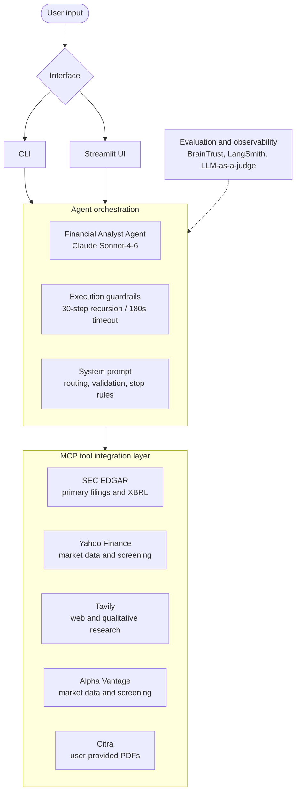

# Financial Analyst Agent

An MCP-powered agent for researching public-company financial data from SEC
filings, market-data services, PDFs, and web research — built to reliably:

1. analyze a company's quarterly report and extract key financial details (income, costs, etc.);
2. return the top N public companies by market size, for any industry;
3. explain how AI can cause disruption and name the most common AI use cases, for any industry.

The rest of this document is the project's engineering report: architecture and tool-selection
reasoning, the evaluation dataset, current benchmark results, and a running log of bugs found in
production traces and the fixes applied. The full illustrated version (with BrainTrust trace
screenshots and the architecture diagram) is [`Financial analyst agent report.pdf`](./Financial%20analyst%20agent%20report.pdf).

## Setup

1. Install dependencies with `uv sync`.
2. Copy `.env.example` to `.env` and populate the API keys you intend to use.
3. Run a query:

   ```bash
   uv run financial-analyst-agent "What was Apple's latest quarterly net income?"
   ```

Use `uv run financial-analyst-agent --help` to see the interactive, demo, and tool-listing modes.

### Example queries

- "What was Google's net income based on their latest quarterly report?"
- "What are the top 10 companies in healthcare?"
- "What are the top 10 companies in healthcare, and what was the reported income for each?"
- "What was Apple's income and costs on their latest quarterly report?"

## Architecture & tool selection reasoning

One primary source per task, chosen from evidence rather than convenience.

**Task 1 — Quarterly report analysis → SEC EDGAR.** A no-document prompt run in Claude
(Sonnet-High) was compared against a run with an attached 10-Q. Results were similar; asking the
no-document run to cite its resources revealed it referenced Apple's actual Form 10-Q, fiscal Q3
2026 (quarter ended June 27, 2026), from the SEC EDGAR site. This confirmed SEC EDGAR as the
correct primary source and justified including an EDGAR MCP server in the tool set.

**Task 2 — Top-N companies → Yahoo Finance (yfinance), fallback Alpha Vantage.** FMP MCP's free
tier lacked the required tool access, so the stack switched to a community yfinance-based MCP
server. Noted risk: Yahoo does not publish or support a public finance API, so yfinance relies on
undocumented endpoints that can change or get rate-limited without notice. Alpha Vantage was
added as fallback specifically because it is the only official, vendor-maintained financial MCP
server currently available — a more dependable backup than another community-built option.

**Task 3 — AI disruption / use-case analysis → Tavily.** A qualitative, open-web research
question — routed to Tavily search/research tools rather than structured financial-data tools.

### Agent architecture

User input arrives through the CLI or Streamlit UI and reaches agent orchestration — the
Financial Analyst Agent on Claude Sonnet-4-6, with execution guardrails (30-step recursion,
180-second timeout) and a system prompt covering routing, validation and stop rules. Evaluation
and observability (BrainTrust, LangSmith, LLM-as-a-judge metrics) wrap the orchestration layer;
the MCP tool integration layer exposes SEC EDGAR, Yahoo Finance, Tavily, Alpha Vantage, and a
user-PDF reader.



## Evaluation

`tests/financial_analyst_eval.py` runs the eval dataset through the real agent and logs results
to [Braintrust](https://www.braintrust.dev).

1. Set `BRAINTRUST_API_KEY` (and optionally `BRAINTRUST_PROJECT`) in `.env`.
2. Run:

   ```bash
   uv run braintrust eval tests/financial_analyst_eval.py
   ```

This calls the live MCP tools and Anthropic API for every case, so it costs real API usage and
can take a while for the full 60-case set.

### Evaluation dataset

A 60-sample (Q&A) evaluation set was built to test the three core capabilities this agent must
perform reliably: extracting specific figures from company filings, ranking public companies by
market size within an industry, and explaining AI-driven disruption trends within an industry —
plus, critically, chaining these together in compound, multi-step prompts (e.g., rank the top N
companies in an industry, then extract a metric for each).

Compound prompts are the harder and more differentiating case for this agent, since they require
the source-routing, stop-rule and sanity-check logic described below to fire correctly across
multiple sequential tool calls rather than once. The dataset's reference answers are the ground
truth the LLM-judge ([Observation #6](#6-scores-dropped-because-the-ground-truth-had-gone-stale))
grades agent output against.

**Sample schema**

| Field | Description |
|---|---|
| `id` | unique integer, 1–60 |
| `category` | one of six values (see below) |
| `question` | the literal prompt given to the agent |
| `answer` | the reference/ground-truth answer |
| `source` | the primary filing, press release or live data source the answer was verified against, with a URL |
| `difficulty` | easy / medium / hard |
| `grading_type` | `factual` for the large majority, or `behavioral` for two samples graded on agent conduct rather than a matchable answer |

Ranking samples and the compound samples that reuse a ranking additionally carry a
`grading_note` field spelling out grading tolerance; edge-case samples carry an `edge_case_type`
field naming the specific failure mode targeted.

**Category breakdown**

| Category | Count | Easy | Medium | Hard |
|---|---|---|---|---|
| single_metric_extraction | 12 | 4 | 5 | 3 |
| multi_metric_extraction | 11 | 0 | 8 | 3 |
| company_ranking | 8 | 4 | 4 | 0 |
| ai_disruption | 8 | 4 | 4 | 0 |
| compound_multi_tool | 13 | 0 | 9 | 4 |
| edge_case | 8 | 0 | 4 | 4 |
| **Total** | **60** | **12** | **34** | **14** |

**Edge-case coverage** (one sample per failure mode)

1. **No public filings.** A company (Cargill) with no SEC filings at all, testing whether the
   agent declines rather than substituting a third-party revenue estimate as if it were
   filing-sourced.
2. **Future unreported quarter.** A fiscal quarter (Nvidia Q2 FY2027) not yet reported as of the
   dataset's construction date, testing whether the agent declines and cites the actual reporting
   date rather than fabricating a result or presenting guidance as an actual.
3. **Post-cutoff answerable.** The mirror-image case: a real, already-occurred event (SpaceX's
   June 2026 IPO) that postdates a typical training cutoff but is fully searchable, testing for
   the opposite failure mode — a lazy refusal or a confidently-stated stale fact ("SpaceX is
   private") instead of searching.
4. **Ticker name collision.** Two distinct public companies sharing a name (The Coca-Cola Company
   vs. Coca-Cola Consolidated), testing whether the agent disambiguates rather than silently
   picking one or blending the two.
5. **Unanswerable subpart.** A compound question where one company doesn't disclose the requested
   metric in the requested form, testing whether the agent flags the gap rather than fabricating
   or quietly substituting a different metric.
6. **Adversarial vague.** A question with no company, period or metric specified, testing whether
   the agent asks a clarifying question rather than guessing.
7. **Nonstandard industry boundary.** An industry ("medical devices") whose membership genuinely
   differs across published rankings depending on methodology, testing whether the agent states
   the ambiguity instead of presenting one aggregator's list as unambiguous fact.
8. **GAAP/non-GAAP embedded in edge framing.** A false-premise question asserting a GAAP figure
   beat a guidance range actually issued on a non-GAAP basis, testing whether the agent corrects
   the premise instead of confirming it.

### Current results

Latest experiment run over the full 60-sample set, grouped by `metadata.category`.

- **Answered:** 98.33% average
- **LLM judge:** 84.91% average
- **Duration:** 3,724.67s sum, all 60 samples

| Category | Samples | % Answered | % LLM judge | Duration (sum) |
|---|---|---|---|---|
| ai_disruption | 8 | 100% | 100% | 589.7s |
| company_ranking | 8 | 100% | 78.13% | 370.33s |
| compound_multi_tool | 13 | 100% | 85.42% | 1,036.14s |
| edge_case | 8 | 100% | 68.75% | 274.84s |
| multi_metric_extraction | 11 | 90.91% | 90.91% | 995.15s |
| single_metric_extraction | 12 | 100% | 84.09% | 458.5s |

Reading across the run: `ai_disruption` is fully solved (100% judge score), while the two weakest
categories are `edge_case` (68.75%) and `company_ranking` (78.13%) — both categories whose grading
depends on conduct and on live, freshly-changing data rather than on a fixed filed figure.
`multi_metric_extraction` is the only category not fully answered (90.91%, i.e. one sample), and
it is also the second most expensive in wall-clock time (995.15s across 11 samples) after
`compound_multi_tool` (1,036.14s across 13).

## Observations and fixes

Each entry records the symptom observed in traces, the root cause found, and the change made.

### 1. Redundant full-statement pulls cost ≈ $0.80 per question

**Question.** "Where did Ford rank among U.S. automakers by revenue in 2024, and what were its
Q2 2026 GAAP revenue and net income/loss?" — cost ≈ $0.80 for a single question.

**Root cause.** Two parallel `edgar_company` calls (GM, Tesla) each returned full income
statement, balance sheet and cash flow, rendered as box-drawing ASCII tables with every XBRL line
item included — thousands of tokens of mostly irrelevant data for a question that only needed one
revenue figure per company. Because this content is freshly generated tool output, prompt caching
could not help on the turn it was produced; and because it then lives in conversation history, it
gets re-billed at full price on every subsequent turn too.

**Fix.** Do not let a failed or ambiguous `edgar_trends` call escalate automatically to the much
larger `edgar_company(include=["financials"])` response.

### 2. Cache breakpoint was static, so the cached prefix never grew

**Symptom.** Caching wasn't done properly. In BrainTrust the cached prompt stayed the same size
and did not increase with each tool call — the read-cache portion of each span stayed flat while
total tokens climbed, so cache hit fell from 97.3% on the first call to 21.4% by the last (cached
prefix flat at ~13K tokens while total tokens grew to 60,786; cache hit degraded
97.3% → 53.9% → 42.3% → 31.2% → 21.4%).

**Fix.** Add a second, moving `cache_control` breakpoint at the end of the message history on
every turn.

**Result.** Cache hit tracks the conversation instead of decaying — after the fix, the cached
prefix grows with the conversation; after a mid-run dip to 32.9%, cache hit recovers to 81.9%,
then 99.1% and 98.6% on spans of 55,110 and 55,877 tokens — a large improvement in estimated cost.

### 3. Self-verification treated as a quality bar

**Symptom.** The agent routinely called a second or third source (Yahoo Finance, Tavily) to
"confirm" a figure it had already retrieved cleanly from the stated primary source, inflating
both tool-call count and token cost. Trace language literally said "I now have confirmed, precise
data from both SEC EDGAR and Yahoo Finance."

**Root cause.** The system prompt said sources are "preferred," not that the agent must stop once
a sufficient result is obtained. "Insufficient evidence" was left as a subjective judgment call
for the model, and a soft "attempt ONE alternative" budget was ambiguous about what counts as one
attempt.

**Fix.** An explicit, numeric stop rule — maximum 2 tool calls total per requested metric (1
primary + 1 fallback), across the entire resolution of that metric, not per tool. "Sufficient" was
defined objectively (a value with a clear period and form-type label) rather than left to the
model's discretion.

### 4. Correct call, wrong number: MSFT FY2026 revenue overstated 2×

**Scenario.** "What was Microsoft's total revenue for fiscal year 2026 (fiscal year ended June
30, 2026)?"

| | Returned | True reported |
|---|---|---|
| Revenue | $684,000,000,000 | $331,839,000,000 |
| Stated YoY growth | 142.8% | ≈17.8–18% |

**Symptom (accuracy).** `edgar_trends(concepts=["revenue"], identifier="MSFT", period="annual", periods=2, include_growth=true)` — called with parameters fully correct per the routing
matrix — returned the figures above.

**Root cause.** Most likely duplicate or overlapping XBRL duration-context facts tagged under the
same revenue concept and period label (e.g. a full-year fact and a partial-year or restated fact
both matching "2026") being summed or mis-selected by `edgar_trends`'s aggregation logic.

**Fix.** Added a `sanity_check_rule` section defining explicit plausibility bounds — YoY/QoQ
growth outside approximately −50% to +100% for an established company is flagged.

### 5. 17.8% vs. 18%: a precision mismatch caused by truncated MD&A

**Scenario.** The same MSFT FY2026 revenue query, during the Observation #4 fallback path.

**Symptom (precision, not correctness).** The final answer reported revenue growth as "17.8%" —
self-calculated from the two raw revenue figures — rather than Microsoft's own stated "18%," the
figure a reference answer built from company language would use. Both are consistent (17.79%
rounds to 18%) and neither is factually wrong, but the mismatch reads as a discrepancy against
precision-sensitive reference answers.

**Root cause.** Inspecting the raw `edgar_read(sections=["financials","mda"])` output directly:
the returned MD&A text includes the "Overview" and bulleted "Highlights" subsections
(segment-level growth only — Cloud +27%, Azure +41%, etc.) but is truncated mid-document, ending
with "… (truncated)" before reaching "Results of Operations," where total-company revenue growth
is conventionally stated in prose ("Revenue increased $X billion or 18%"). The agent did not
ignore an available stated figure; the figure was never present in the text it had access to.

**Fix.** None yet at the tool level.

### 6. Scores dropped because the ground truth had gone stale

**Question.** "List the top 5 U.S. banks by market capitalization as of today, with each bank's
market cap."

**Symptom.** Although the agent had previously produced precise results for this category of
question, it stopped generating correct answers and the LLM judge gave lower scores for them.

**Fix.** Reviewing the generated answers showed the agent was still providing correct answers;
because of the live nature of these questions, the ground-truth answer had gone out of date.
After fixing the ground truth, the agent scored correct results again.

## Project layout

```text
src/financial_analyst_agent/
├── __init__.py
├── agent.py       # Agent construction and query execution
├── cli.py         # CLI and interactive REPL
├── config.py      # Environment-backed runtime configuration
├── mcp.py         # MCP discovery and tool filtering
└── prompts/
    ├── __init__.py
    ├── financial_analyst_v1.py
    ├── financial_analyst_v2.py
    ├── financial_analyst_v3.py
    └── financial_analyst_v4.py   # current SYSTEM_PROMPT
```
